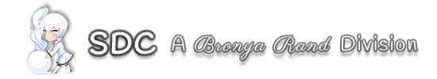

# Welcome to DDLC: Afterword!

  

  

Afterword is based on a mod template made by Azariel Del Carmen (bronya_rand) for the **original** Doki Doki Literature Club that adheres to [Team Salvato's IP Guidelines](http://teamsalvato.com/ip-guidelines/) for fan mods on Ren'Py 8.

> Additionaly [here](./CREDITS.md) are all the contributors that contributed to the template.
> Thetemplate and the mod itself are not afilliated in any way with Team Salvato.

The template used belongs to bronya_rand. Copyright © 2019-2023 Azariel Del Carmen (bronya_rand). All rights reserved.

Doki Doki Literature Club, the Doki Doki Literature Club code, is the property of Team Salvato (Dan Salvato LLC). Copyright © 2017 Team Salvato. All rights reserved.
